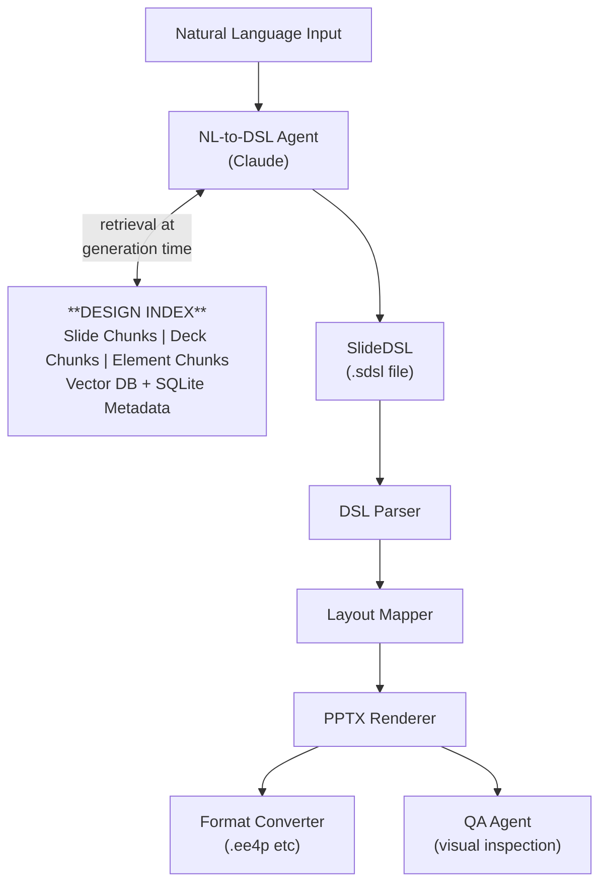

# SlideDSL — Agentic Slide Generation Platform

[](https://github.com/unnitin/slides/actions/workflows/ci.yml)
[](https://www.python.org/downloads/)
[](https://github.com/unnitin/slides/blob/main/LICENSE)
[](https://docs.astral.sh/ruff/)

## What This Is

A Python-based system that converts natural language → a domain-specific language (DSL) → rendered `.pptx` (or `.ee4p`) presentations, with a semantic design index that learns over time which slides, layouts, and visual treatments work best for your organization.

## Architecture



## Project Structure

```
slidedsl/
├── CLAUDE.md                   # ◀ Claude Code reads this first
├── README.md                   # This file
├── pyproject.toml              # Dependencies & project config
│
├── specs/                      # ◀ Specifications (read before building)
│   ├── DSL_SPEC.md             # Full DSL grammar reference
│   ├── INDEX_SPEC.md           # Design index architecture
│   ├── AGENT_SPEC.md           # NL-to-DSL agent contract
│   └── RENDERER_SPEC.md        # PPTX rendering rules
│
├── agents/                     # ◀ Agent definitions (prompts + configs)
│   ├── nl_to_dsl.py            # Natural language → DSL translation
│   ├── qa_agent.py             # Visual QA inspection loop
│   ├── index_curator.py        # Background index enrichment agent
│   └── prompts/                # System prompts as text files
│       ├── nl_to_dsl.txt
│       ├── qa_inspection.txt
│       └── index_curation.txt
│
├── skills/                     # ◀ Composable capabilities
│   ├── dsl_parse.py            # Parse DSL → data model
│   ├── dsl_serialize.py        # Data model → DSL text
│   ├── chunk_slide.py          # Multi-granularity chunking
│   ├── embed.py                # Embedding generation
│   ├── index_search.py         # Semantic + structural search
│   ├── render_pptx.py          # python-pptx rendering
│   ├── template_analyze.py     # Template introspection
│   └── format_convert.py       # .pptx → .ee4p converter plugin
│
├── src/                        # ◀ Core library code
│   ├── dsl/
│   │   ├── __init__.py
│   │   ├── models.py           # Pydantic data model
│   │   ├── parser.py           # DSL parser
│   │   └── serializer.py       # DSL serializer
│   ├── index/
│   │   ├── __init__.py
│   │   ├── chunker.py          # Multi-granularity chunking
│   │   ├── store.py            # SQLite + vector store
│   │   └── retriever.py        # Search & retrieval
│   ├── renderer/
│   │   ├── __init__.py
│   │   ├── pptx_renderer.py    # python-pptx rendering
│   │   └── format_plugins.py   # Converter plugin system
│   └── services/
│       ├── __init__.py
│       ├── orchestrator.py     # End-to-end pipeline
│       └── feedback.py         # User feedback → index updates
│
├── templates/                  # Company .pptx templates
│   └── .gitkeep
├── scripts/
│   ├── ingest_deck.py          # Ingest existing .pptx into the index
│   ├── benchmark.py            # Measure index retrieval quality
│   └── seed_index.py           # Bootstrap index from existing decks
├── tests/
│   ├── test_parser.py
│   ├── test_chunker.py
│   ├── test_index.py
│   └── test_renderer.py
└── docs/
    └── examples/
        └── sample.sdsl         # Example DSL file
```

## Getting Started

```bash
# Install
pip install -e ".[dev]"

# Parse a DSL file
python -m slidedsl parse docs/examples/sample.sdsl

# Generate from natural language
python -m slidedsl generate "Q3 data platform update for leadership"

# Ingest an existing deck into the index
python scripts/ingest_deck.py path/to/existing.pptx

# Render DSL to PPTX
python -m slidedsl render docs/examples/sample.sdsl -o output.pptx
```
