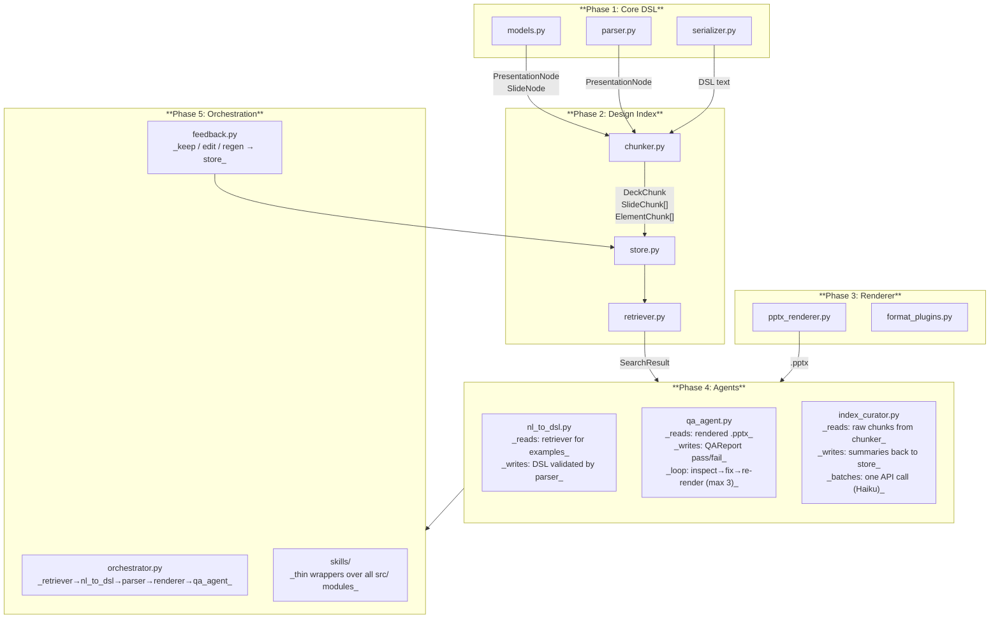
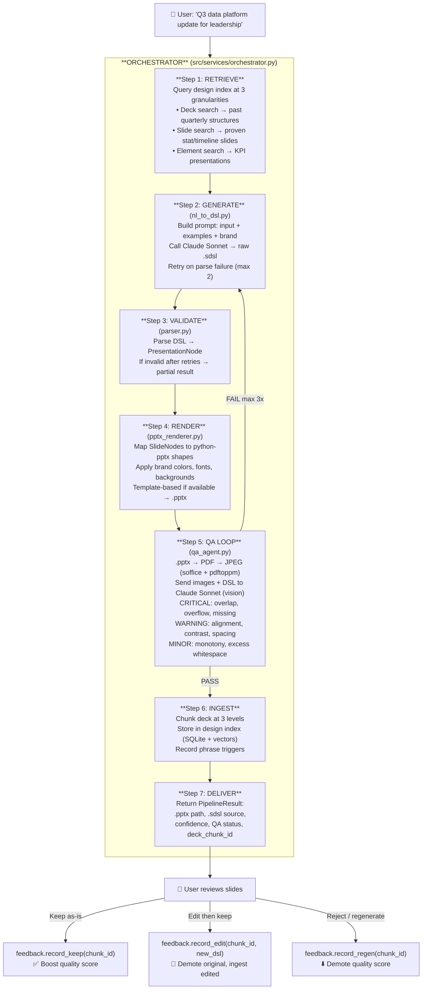
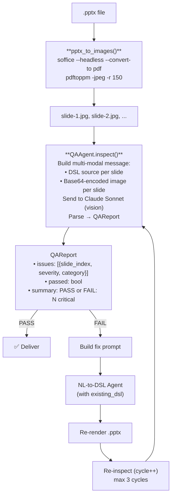
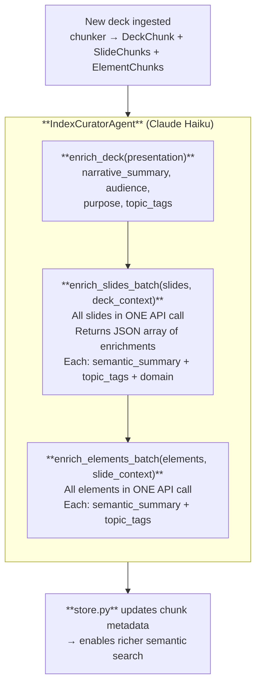
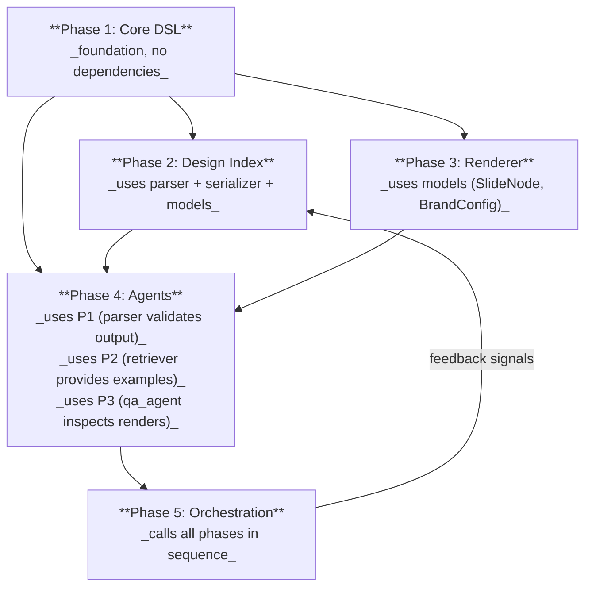
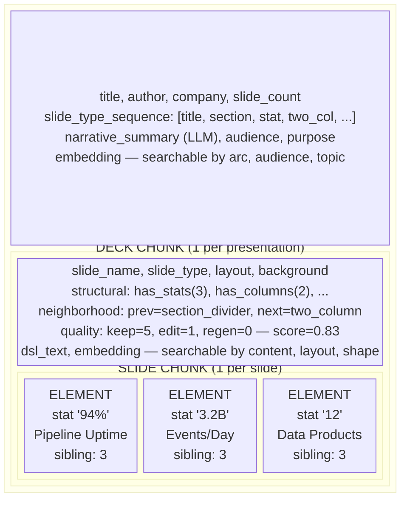

# SlideDSL -- Architecture

## Phase Dependency Graph



## User Flow (End-to-End)



## QA Loop Detail



## Index Curator Flow (Background)



## Phase Dependency Summary



What each phase gives to the others:

| Producer | Consumer | What flows between them |
|----------|----------|------------------------|
| Phase 1 | Phase 2 | `PresentationNode` for chunking, `serializer` for DSL text in chunks |
| Phase 1 | Phase 3 | `SlideNode`, `BrandConfig` drive rendering decisions |
| Phase 1 | Phase 4 | `parser` validates agent-generated DSL |
| Phase 2 | Phase 4 | `SearchResult` with proven DSL examples for few-shot prompts |
| Phase 2 | Phase 5 | `store` receives feedback signals from `feedback.py` |
| Phase 3 | Phase 4 | rendered `.pptx` for `qa_agent` visual inspection |
| Phase 4 | Phase 5 | DSL text + QAReport consumed by orchestrator pipeline |
| Phase 5 | Phase 2 | feedback loop: keep/edit/regen signals update chunk quality scores |

## Agent Contracts

| Agent | Model | Input | Output | API Calls |
|-------|-------|-------|--------|-----------|
| NL-to-DSL | claude-sonnet-4-5 | user text + retrieved examples | valid .sdsl text | 1 + up to 2 retries |
| QA Agent | claude-sonnet-4-5 | slide images + DSL source | QAReport (issues + pass/fail) | 1 per QA cycle (max 3) |
| Index Curator | claude-haiku-4-5 | chunk DSL text | JSON enrichments (summary, tags, domain) | 1 per deck (batched) |

Total per generation: ~4-7 API calls. Total per ingestion: ~1-2 API calls.

## Three-Level Chunking (Phase 2 Detail)



## File Tree by Phase

```
slidedsl/
│
├── PHASE 1 ─────────────────────────────────────
│   src/dsl/
│   ├── models.py              data models (PresentationNode, SlideNode)
│   ├── parser.py              .sdsl text --> PresentationNode
│   └── serializer.py          PresentationNode --> .sdsl text
│   tests/
│   └── test_parser.py         36 tests
│
├── PHASE 2 ─────────────────────────────────────
│   src/index/
│   ├── chunker.py             3-level chunking
│   ├── store.py               SQLite + FTS5 + vector BLOBs
│   └── retriever.py           hybrid search
│   scripts/
│   ├── ingest_deck.py         single deck ingestion
│   └── seed_index.py          batch ingestion
│   tests/
│   ├── test_chunker.py        30 tests
│   └── test_index.py          34 tests
│
├── PHASE 3 ─────────────────────────────────────
│   src/renderer/
│   ├── pptx_renderer.py       SlideNode --> python-pptx shapes
│   └── format_plugins.py      .pptx --> .ee4p / .pdf converters
│   tests/
│   └── test_renderer.py
│
├── PHASE 4 ─────────────────────────────────────
│   agents/
│   ├── nl_to_dsl.py           NL --> DSL agent (Claude Sonnet)
│   ├── qa_agent.py            visual QA loop (Claude Sonnet + vision)
│   ├── index_curator.py       semantic enrichment (Claude Haiku)
│   └── prompts/
│       ├── nl_to_dsl.txt      generation system prompt
│       ├── qa_inspection.txt  QA inspection system prompt
│       └── index_curation.txt curation system prompt
│   tests/
│   └── test_agents.py         25 tests
│
├── PHASE 5 ─────────────────────────────────────
│   src/services/
│   ├── orchestrator.py        end-to-end pipeline with QA loop
│   └── feedback.py            learning loop (keep/edit/regen)
│   skills/
│   ├── dsl_parse.py           wraps parser
│   ├── dsl_serialize.py       wraps serializer
│   ├── chunk_slide.py         wraps chunker
│   ├── embed.py               embedding text generation
│   ├── index_search.py        wraps retriever + store
│   ├── render_pptx.py         wraps pptx_renderer
│   ├── template_analyze.py    .pptx template introspection
│   └── format_convert.py      wraps format_plugins
│
└── SHARED ──────────────────────────────────────
    docs/examples/sample.sdsl  test fixture (read-only)
    specs/*.md                 specifications (read-only)
    templates/                 company .pptx templates
```
