# SlideForge -- Architecture

## Phase Dependency Graph

```mermaid
flowchart TD
    subgraph P1["**Phase 1: Core DSL**"]
        models["models.py"]
        parser["parser.py"]
        serializer["serializer.py"]
    end

    subgraph P2["**Phase 2: Design Index**"]
        chunker["chunker.py"]
        store["store.py"]
        retriever["retriever.py"]
    end

    subgraph P3["**Phase 3: Renderer**"]
        pptx_renderer["pptx_renderer.py"]
        format_plugins["format_plugins.py"]
    end

    subgraph P4["**Phase 4: Agents**"]
        direction TB
        nl_to_dsl["nl_to_dsl.py<br/>reads: retriever for examples<br/>writes: DSL validated by parser"]
        qa_agent["qa_agent.py<br/>reads: rendered .pptx<br/>writes: QAReport pass/fail<br/>loop: inspect→fix→re-render (max 3)"]
        index_curator["index_curator.py<br/>reads: raw chunks from chunker<br/>writes: summaries back to store<br/>batches: one API call (Haiku)"]
    end

    subgraph P5["**Phase 5: Orchestration**"]
        orchestrator["orchestrator.py<br/>retriever→nl_to_dsl→parser→renderer→qa_agent"]
        feedback["feedback.py<br/>keep / edit / regen → store"]
        skills["skills/<br/>thin wrappers over all src/ modules"]
    end

    models -->|"PresentationNode<br/>SlideNode"| chunker
    parser -->|"PresentationNode"| chunker
    serializer -->|"DSL text"| chunker
    chunker -->|"DeckChunk<br/>SlideChunk[]<br/>ElementChunk[]"| store
    store --> retriever
    retriever -->|"SearchResult"| P4
    pptx_renderer -->|".pptx"| P4
    P4 --> P5
    feedback --> store
```



## User Flow (End-to-End)


## QA Loop Detail

```mermaid
flowchart TD
    pptx[".pptx file"]
    convert["**pptx_to_images()**<br/>soffice --headless --convert-to pdf<br/>pdftoppm -jpeg -r 150"]
    images["slide-1.jpg, slide-2.jpg, ..."]
    inspect["**QAAgent.inspect()**<br/>Build multi-modal message:<br/>• DSL source per slide<br/>• Base64-encoded image per slide<br/>Send to Claude Sonnet (vision)<br/>Parse → QAReport"]
    report["QAReport<br/>• issues: [{slide_index, severity, category}]<br/>• passed: bool<br/>• summary: PASS or FAIL: N critical"]

    pptx --> convert --> images --> inspect --> report

    report -->|PASS| deliver["✅ Deliver"]
    report -->|FAIL| fix["Build fix prompt"]
    fix --> nl_to_dsl["NL-to-DSL Agent<br/>(with existing_dsl)"]
    nl_to_dsl --> rerender["Re-render .pptx"]
    rerender --> reinspect["Re-inspect (cycle++)<br/>max 3 cycles"]
    reinspect --> inspect
```



## Index Curator Flow (Background)

```mermaid
flowchart TD
    ingest["New deck ingested<br/>chunker → DeckChunk + SlideChunks + ElementChunks"]

    subgraph curator["**IndexCuratorAgent** (Claude Haiku)"]
        direction TB
        enrich_deck["**enrich_deck(presentation)**<br/>narrative_summary, audience,<br/>purpose, topic_tags"]
        enrich_slides["**enrich_slides_batch(slides, deck_context)**<br/>All slides in ONE API call<br/>Returns JSON array of enrichments<br/>Each: semantic_summary + topic_tags + domain"]
        enrich_elements["**enrich_elements_batch(elements, slide_context)**<br/>All elements in ONE API call<br/>Each: semantic_summary + topic_tags"]

        enrich_deck --> enrich_slides --> enrich_elements
    end

    store["**store.py** updates chunk metadata<br/>→ enables richer semantic search"]

    ingest --> curator --> store
```



## Phase Dependency Summary


What each phase gives to the others:

| Producer | Consumer | What flows between them |
|----------|----------|------------------------|
| Phase 1 | Phase 2 | `PresentationNode` for chunking, `serializer` for DSL text in chunks |
| Phase 1 | Phase 3 | `SlideNode`, `BrandConfig` drive rendering decisions |
| Phase 1 | Phase 4 | `parser` validates agent-generated DSL |
| Phase 2 | Phase 4 | `SearchResult` with proven DSL examples for few-shot prompts |
| Phase 2 | Phase 5 | `store` receives feedback signals from `feedback.py` |
| Phase 3 | Phase 4 | rendered `.pptx` for `qa_agent` visual inspection |
| Phase 4 | Phase 5 | DSL text + QAReport consumed by orchestrator pipeline |
| Phase 5 | Phase 2 | feedback loop: keep/edit/regen signals update chunk quality scores |

## Agent Contracts

| Agent | Model | Input | Output | API Calls |
|-------|-------|-------|--------|-----------|
| NL-to-DSL | claude-sonnet-4-5 | user text + retrieved examples | valid .sdsl text | 1 + up to 2 retries |
| QA Agent | claude-sonnet-4-5 | slide images + DSL source | QAReport (issues + pass/fail) | 1 per QA cycle (max 3) |
| Index Curator | claude-haiku-4-5 | chunk DSL text | JSON enrichments (summary, tags, domain) | 1 per deck (batched) |

Total per generation: ~4-7 API calls. Total per ingestion: ~1-2 API calls.

## Three-Level Chunking (Phase 2 Detail)

```mermaid
block-beta
    columns 1

    block:deck["DECK CHUNK (1 per presentation)"]
        columns 1
        deck_meta["title, author, company, slide_count<br/>slide_type_sequence: [title, section, stat, two_col, ...]<br/>narrative_summary (LLM), audience, purpose<br/>embedding — searchable by arc, audience, topic"]

        block:slide["SLIDE CHUNK (1 per slide)"]
            columns 1
            slide_meta["slide_name, slide_type, layout, background<br/>structural: has_stats(3), has_columns(2), ...<br/>neighborhood: prev=section_divider, next=two_column<br/>quality: keep=5, edit=1, regen=0 — score=0.83<br/>dsl_text, embedding — searchable by content, layout, shape"]

            block:elements
                columns 3
                e1["ELEMENT<br/>stat '94%'<br/>Pipeline Uptime<br/>sibling: 3"]
                e2["ELEMENT<br/>stat '3.2B'<br/>Events/Day<br/>sibling: 3"]
                e3["ELEMENT<br/>stat '12'<br/>Data Products<br/>sibling: 3"]
            end
        end
    end
```



## File Tree by Phase

```
slideforge/
│
├── PHASE 1 ─────────────────────────────────────
│   src/dsl/
│   ├── models.py              data models (PresentationNode, SlideNode)
│   ├── parser.py              .sdsl text --> PresentationNode
│   └── serializer.py          PresentationNode --> .sdsl text
│   tests/
│   └── test_parser.py         36 tests
│
├── PHASE 2 ─────────────────────────────────────
│   src/index/
│   ├── chunker.py             3-level chunking
│   ├── store.py               SQLite + FTS5 + vector BLOBs
│   └── retriever.py           hybrid search
│   scripts/
│   ├── ingest_deck.py         single deck ingestion
│   └── seed_index.py          batch ingestion
│   tests/
│   ├── test_chunker.py        30 tests
│   └── test_index.py          34 tests
│
├── PHASE 3 ─────────────────────────────────────
│   src/renderer/
│   ├── pptx_renderer.py       SlideNode --> python-pptx shapes
│   └── format_plugins.py      .pptx --> .ee4p / .pdf converters
│   tests/
│   └── test_renderer.py
│
├── PHASE 4 ─────────────────────────────────────
│   agents/
│   ├── nl_to_dsl.py           NL --> DSL agent (Claude Sonnet)
│   ├── qa_agent.py            visual QA loop (Claude Sonnet + vision)
│   ├── index_curator.py       semantic enrichment (Claude Haiku)
│   └── prompts/
│       ├── nl_to_dsl.txt      generation system prompt
│       ├── qa_inspection.txt  QA inspection system prompt
│       └── index_curation.txt curation system prompt
│   tests/
│   └── test_agents.py         25 tests
│
├── PHASE 5 ─────────────────────────────────────
│   src/services/
│   ├── orchestrator.py        end-to-end pipeline with QA loop
│   └── feedback.py            learning loop (keep/edit/regen)
│   skills/
│   ├── dsl_parse.py           wraps parser
│   ├── dsl_serialize.py       wraps serializer
│   ├── chunk_slide.py         wraps chunker
│   ├── embed.py               embedding text generation
│   ├── index_search.py        wraps retriever + store
│   ├── render_pptx.py         wraps pptx_renderer
│   ├── template_analyze.py    .pptx template introspection
│   └── format_convert.py      wraps format_plugins
│
└── SHARED ──────────────────────────────────────
    docs/examples/sample.sdsl  test fixture (read-only)
    specs/*.md                 specifications (read-only)
    templates/                 company .pptx templates
```
